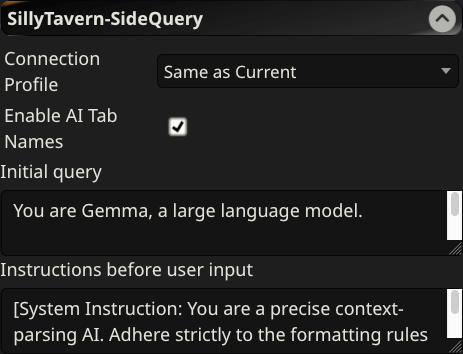

# SillyTavern-SideQuery
This extension adds a side query panel to SillyTavern, allowing you to generate AI responses based on the current chat's worldinfo, characters, and persona without interfering with the main chat flow.

Every side query session is saved with the current chat, ensuring your research and notes persist.

## Features
- **Multi-Tab Support & Drag Reordering**: Create multiple query tabs to track different threads of thought or research simultaneously. Drag and drop tabs horizontally to seamlessly reorganize your workspace. *(Note: Closing a tab is automatically disabled when it is the last remaining tab to preserve your workspace).*
- **Persistent Query Storage Presets**: Save, load, and manage your favorite prompt templates directly within the panel using a compact presets bar:
    - **Select Dropdown**: Selecting a saved preset instantly overwrites the query input textarea with your saved template. The selection automatically resets to empty once you send a query.
    - **Save (Disk Icon)**: Overwrites the active template with your current input, or triggers the "Save As" inline popup if no preset is currently selected.
    - **Save As (Folder Plus Icon)**: Opens an absolute-positioned popover to save your active input under a new custom name.
    - **Delete (Trash Icon)**: Permanently removes the selected preset from your saved configurations.
- **Flexible Tab Renaming**: Keep tabs structured with descriptive custom titles.
    - Click the **Pencil Edit Icon** next to any tab name to modify it inline.
- Alternatively, **Double-Click** the tab header element to rename it.
- **Smart AI Tab Naming (Optional)**: Automatically analyze your first exchange inside a new tab and invoke the AI in the background to generate a short, context-aware title (1-3 words). Features a safety truncation guardrail that cleanly trims long or verbose reasoning model answers down to 25 characters max to keep the UI perfectly compact.
- **Per-Message Navigation Anchors**: Navigate efficiently through exceptionally long outputs or extensive multi-paragraph descriptions. Every message includes localized anchor actions:
    - Click the **Arrow Down Icon** in the message header tray to smoothly scroll directly down to the bottom line of that specific block.
    - Click the **Top Button** located next to the generation metadata line at the base row of the card to instantly glide back up to the top header boundary of that message.
- **Message Exclusion Toggles**: Gain granular control over context memory. Every message in the conversation features a visibility eye icon allowing you to completely exclude/include specific messages from the next prompt generation context while keeping them visible in the chat log.
- **Inline Message Editing**: Modify previous queries or saved assistant text elements directly within the side panel layout by clicking the **Pencil Icon** on any message header card. Saves instantly via `Ctrl+Enter` / `Cmd+Enter` or by clicking outside the input field. *(Note: AI reasoning/thinking streams are protected from manual revision logs).*
- **Generation Settings Indicator**: Every AI reply displays an elegant, muted snapshot footnote detailing exactly what context items were used to build that specific prompt (e.g., `Generated using: Persona, Characters, Worldinfo (Normal WI), Messages 5-10`). This information stays backgrounded and is excluded from print layouts.
- **Selection Preservation**: Read and highlight text seamlessly while the model is typing. Incoming streaming chunks append dynamically without resetting or breaking your active text selection inside message elements.
- **Persistent Scroll Positions**: Individual chat log scroll coordinates are tracked dynamically per tab. Swapping between tabs or closing/reopening the main drawer panel will seamlessly restore your exact reading position without snapping back to the bottom.
- **Smart Autoscroll Locking**: The panel stays locked to the bottom during active message generation, but smartly suppresses autoscroll snapping while background title-generation cycles or header layout modifications are actively running.
- **Filtered PDF Export Menu**: Export individual conversation logs into structured document layouts with precise formatting controls. Clicking the **PDF Icon** opens a dropdown filter selector to choose compilation constraints:
    - **Full Export**: Generates a complete history trace containing all inputs, replies, and thinking trails.
    - **Hide Thought Chains**: Strips long background reasoning summaries from assistant output logs.
    - **Hide User Prompts**: Removes user-submitted questions, tracking assistant text blocks exclusively.
    - **AI Responses Only**: Clears out reasoning traces and user prompts to compile a clean, standalone story script.
- **Customizable Context**: Choose exactly what information is sent to the AI for each query:
    - Persona
    - Character definitions
    - World Info (Lorebook)
    - Scenario
    - Enlarged, dedicated Message Range controls (`From` / `To` boundaries) from the current chat grouped logically on a single configuration line.
- **WorldInfo Trigger Optimization**: Squeezed onto a space-saving config line to choose your scanning mode:
    - **Normal WI**: Standard keyword evaluation against chat history and keywords.
    - **SideQuery WI**: Forces an isolated scan key to bypass or enforce strict inclusion rules.
- **Independent Connection**: Use a different connection profile for side queries than the one used for the main chat.
- **Thought Process Visibility**: Supports displaying reasoning/thinking blocks if the underlying model provides them (fully compatible with advanced thinking models).
- **Chat Management**: Undo last messages or regenerate the last response. Automatically reverts/resets generated titles back to default states on an UNDO unless you explicitly locked a manual custom name.
- **Include and exclude worldinfo entries**:
    - **Include**: Select which worldinfo entries to include in the context - use SIDEQUERY_TRIGGER as a keyword.
    - **Exclude**: To exclude specific entries, select **SideQuery WI** in the menu and mark those entries with specific native triggers (like Chat, Lore, etc.) in SillyTavern. The scanner will fail to validate them, safely keeping them out of your side panel context.

## How to install
1. Paste the URL of this repository into the **Install extension** dialog in SillyTavern.
2. Go to the **Extensions** tab to configure the connection profile for side queries.
3. (Optional) Customize the initial system query and instructions in the settings.

## Configuration
In the extension settings, you can:
- **Connection Profile**: Select a specific profile or use the "Same as Current" setting.
- **Enable AI Tab Names**: Toggle whether the extension prompts the model to auto-generate a context-aware 1-3 word title for your tab after the first exchange. (Default: `false`)
- **Initial Query**: Define the system prompt that initializes every new side query.
- **Instructions before user input**: Add specific formatting or behavioral instructions that are injected immediately before your query.

## Screenshots

### General Overview

### Extension Settings

