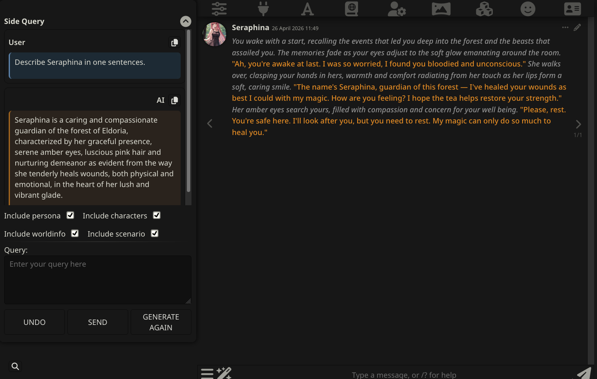

# SillyTavern-SidePrompt
This extension adds a side prompt button to the bottom of the screen. You can use side prompt to generate AI responses based on the current chat worldinfo and characters and persona.

Every side query is saved with the current chat.

## How to install
1. Paste an url of this repository into the Install extension dialog.
2. Go to the Extensions tab and choose a connection for the side prompt.
3. (optionally) Change the initial prompt sent.

## Example

